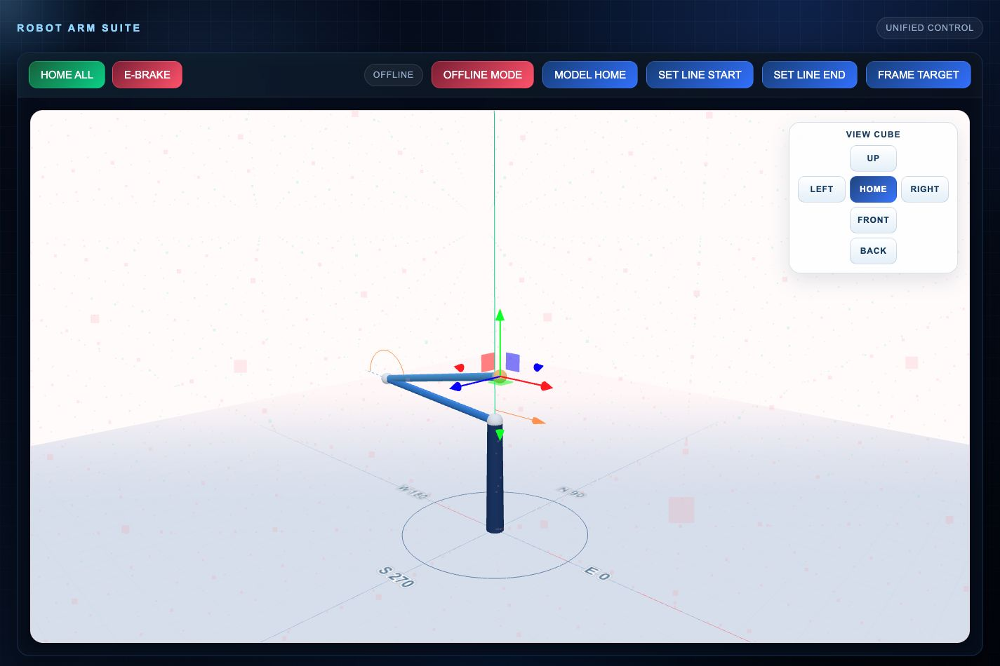

# ChessMaster

ChessMaster is a full-stack robotic chess project: a Raspberry Pi camera app for board/piece recognition, a browser-based 3D inverse-kinematics UI for a physical robotic arm, Arduino/CNC-shield firmware for the motors, and CAD files for the printed arm assembly.



<p align="center">
  
</p>

## What This Shows

- **3D robotic arm control:** `apps/robot-web` renders a Three.js arm model with draggable target controls, forward/inverse kinematics, saved positions, and Cartesian line moves.
- **Hardware control path:** the robot UI converts reachable 3D targets into axis step targets and sends them to an Arduino arm controller over serial.
- **Chess vision pipeline:** `apps/vision` runs a Raspberry Pi camera web UI with OpenCV board detection, square crops, calibration, labels, FEN generation, and starter piece-recognition tools.
- **Embedded firmware:** `firmware` contains Arduino/CNC Shield sketches for homing, limit switches, coordinated stepper motion, and serial commands.
- **Physical design:** `hardware/cad` contains STL exports for the arm, base, claw, gears, and chess pieces.

## Project Layout

```text
apps/
  robot-web/      Main 3D IK robotic arm UI and movement API
  vision/         Raspberry Pi camera/CV chessboard app
  arm-ui/         Simpler direct axis/stepper control UI
  arm-test/       Arm test app and matching Arduino sketch
  chessbot-test/  Small chess/Stockfish experiments
firmware/         Arduino and CNC-shield sketches
hardware/cad/     Printable CAD/STL assets
models/           YOLO/model assets used by Pi-side experiments
scripts/          Standalone camera and YOLO stream scripts
data/             Non-secret calibration and saved-position examples
docs/             README images and supporting docs
```

## Main Apps

### 3D Robot Arm UI

```sh
cd apps/robot-web
python3 -m venv .venv
source .venv/bin/activate
pip install -r requirements.txt
python app.py
```

Open `http://localhost:5000`.

The UI can run without the robot attached in offline mode. Online robot movement expects an Arduino-compatible controller at `/dev/ttyACM0`.

### Chess Vision Camera App

```sh
cd apps/vision
python3 -m venv .venv
source .venv/bin/activate
pip install -r requirements.txt
python app.py
```

Open `http://localhost:8000`.

The camera app is intended for Raspberry Pi hardware with a supported camera module. See `apps/vision/README.md` for Pi setup and service installation notes.

## Hardware Notes

The robot control code was built around a Raspberry Pi, Arduino Uno/CNC Shield V3, A4988 stepper drivers, limit switches, and a custom 3-axis printed arm. The web UI and CV app can be inspected without hardware, but real movement/camera capture require the Pi and controller connections.

## Safety And Privacy

This public repo excludes local virtual environments, generated camera captures, logs, caches, `.env` files, and oversized CAD source archives. Non-secret calibration examples and saved robot positions are included so the control and vision workflows are understandable.
